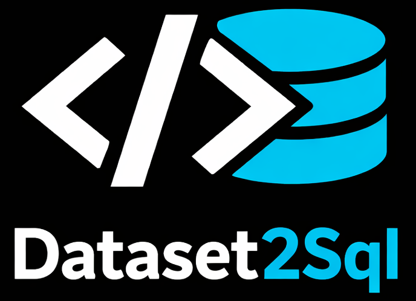

_Insert XML serialized datasets into MSSQL DBs._

`DataSet2Sql` is a fast, interactive CLI tool that reads .NET `DataSet`s serialized as XML and automatically recreates them in a Microsoft SQL Server database.

It handles table creation, data type mapping, and fast data insertion using `SqlBulkCopy`, allowing you to quickly restore datasets without writing manual SQL scripts.

## Features

- **Automated Schema Creation**: Automatically reads the XML dataset and maps .NET types to SQL Server types to create tables.
- **Fast Imports**: Uses `SqlBulkCopy` for highly performant, batch data insertion.
- **Interactive CLI**: Built with `Spectre.Console`, providing helpful, beautiful prompts if arguments are missing.
- **Safety Checks**: Confirms before dropping existing databases, preventing accidental data loss (can be bypassed with `--yes`).
- **Configuration Management**: Manage database credentials cleanly via a local configuration file.

## Installation

### Windows (PowerShell)

```powershell
irm https://github.com/FelixDamrau/DataSet2Sql/releases/latest/download/dataset2sql-installer.ps1 | iex
```

### Linux & macOS

```bash
curl --proto '=https' --tlsv1.2 -LsSf https://github.com/FelixDamrau/DataSet2Sql/releases/latest/download/dataset2sql-installer.sh | sh
```

## Configuration

Run `DataSet2Sql config init` to create a default config file. This file stores your target MSSQL connection details.

| Platform | Path                                                                  |
| -------- | --------------------------------------------------------------------- |
| Linux    | `~/.config/DataSet2Sql/dataset2sql.settings.json`                     |
| macOS    | `~/Library/Application Support/DataSet2Sql/dataset2sql.settings.json` |
| Windows  | `%APPDATA%\DataSet2Sql\dataset2sql.settings.json`                     |

Example config:

```json
{
  "DatabaseSettings": {
    "Server": "localhost",
    "Name": "DumpDb",
    "Username": "dbUser",
    "Password": "userPass"
  }
}
```

Find your active config path anytime by running:

```bash
DataSet2Sql config path
```

## Usage

### 1. Interactive Mode

Run the tool without arguments to enter the interactive prompt:

```bash
DataSet2Sql
```

### 2. Fast Import

Or just pass arguments via the CLI:

```bash
DataSet2Sql import --xml ./dump.xml --db MyDatabase --yes
```

## License

[GPLv3](LICENSE.md)
